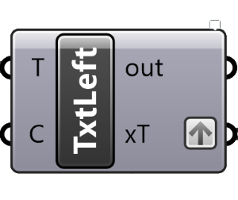
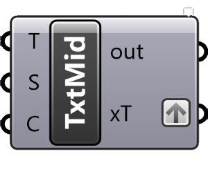

# GH-Text
## Description
A series of GH Text components to extend the in-built versions in grasshopper

## The ribbon

# Components
## Regex

### Inputs 
`T` - Text to transform
`Rgx` - regex pattern
## Left

### Inputs 
`T` - Text to transform
C - Number of characters required from the left
## Mid

### Inputs 
`T` - Text to transform
`S` - Starting character
`C` - Number of characters from the starting point
## Right

### Inputs 
`T` - Text to transform
`C` - Number of characters required from the right

## codebook
